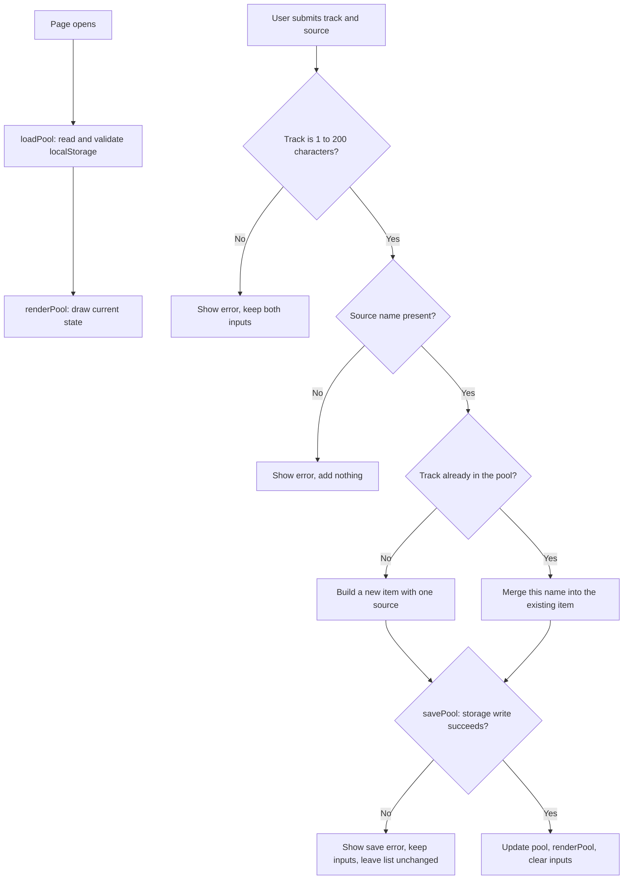

# The Pool

## What

Two interviews found the same thing from opposite directions: the music people trust most comes from other people, and none of it has anywhere to live. A track played in a friend's Spotify Jam is gone when the session ends. A recommendation from a musician friend survives only as long as you remember it. Streaming services give algorithmic suggestions a permanent home and give human ones none. This repository holds the specification for a system that fixes that, plus a working slice of it: a pool where **nothing enters without the name of the person it came from**, and where the list survives a reload. The automatic capture the full spec describes is deliberately absent, for reasons in [ADR-001](context/ARCHITECTURE.md). Background: [PROJECT.md](context/PROJECT.md) for the problem and its framing, [FEATURES.md](context/FEATURES.md) for the specification and verification results.

## See It Work

This shows acceptance criterion **A5**: the system displays a source name on every pool item and displays no item without one. The recording covers a valid entry, a rejected entry with no source, and the pool surviving a page reload.

## How to Run

This project runs inside a GitHub Codespace. No local install.

1. On the repository page, click **Code → Codespaces → Create codespace on main**. Wait for setup to finish.
2. Keep the supplied `.devcontainer/devcontainer.json`. It installs Live Server and forwards port 5500. Right-click `index.html` and choose **Open with Live Server**, or use **Go Live**.
3. If no browser tab opens, use the **Ports** tab to open port 5500. Keep its visibility **Private**.
4. Enter a track and the name of the person it came from, then press **Add to pool**.

To see the save-failure path, add `?failSave` to the page URL. The save is refused, your typed values stay put, and the list is left alone. To start from an empty pool, open DevTools → **Application → Local Storage** and delete the `mgt3745.pool.v1` key.

If Live Server is unavailable, run `node scripts/serve.mjs` in the terminal, then open port 5500 from the Ports tab. Stop it with **Ctrl+C**, and run only one server on port 5500 at a time. Serve over HTTP rather than opening `index.html` through `file://`.

## How It Works

In `app.js`, `loadPool` reads stored data and rejects any item without a source name, `savePool` attempts to persist a proposed state and reports whether it worked, and `renderPool` draws the current state using `textContent` for anything typed by a user. The submit handler validates both fields, decides between creating an item and merging a name into an existing one, and changes what is on screen only after a successful write. Remove works the same way: it saves the proposed list first, then redraws.

## Status

| Area | State | Why |
|------|-------|-----|
| Add an item with a source (A5) | Works | [Verification](context/FEATURES.md#verification) |
| Reject an item with no source (A5) | Works | [Verification](context/FEATURES.md#verification) |
| Data survives reload and save failure | Works | [Verification](context/FEATURES.md#verification) |
| Two people, one track (A6) | Works | [Verification](context/FEATURES.md#verification) |
| Automatic capture (A1–A4, A7) | Deferred | No platform exposes shared-session events. See [ADR-001](context/ARCHITECTURE.md). |

Verification results (click to expand)

The full record is in the [Verification section of FEATURES.md](context/FEATURES.md#verification), including the deferred and untestable criteria. Keep both consistent.

| Criterion | Steps and input | Expected result | Observed result | Status | Evidence / commit |
|---|---|---|---|---|---|
| A5 (normal action) | Enter a track and a source name, then submit. | The item appears with "from [name]" and the date added. | The item appeared with its source name and date. | PASS | Commit 8eafa45 |
| A5 (invalid input) | Enter a track, leave the source empty, submit. | An error appears and nothing is added. | An error appeared and nothing was added. | PASS | Commit 8eafa45 |
| A5 (persistence) | Add two items, reload the page. | Both reappear with their source names. | Both came back after reload. | PASS | Commit 8eafa45 |
| A5 (save failure) | Add `?failSave` to the URL, submit a valid entry. | Save error, typed text stays, list unchanged. | The error appeared and the typed text stayed. | PASS | Commit 8eafa45 |
| A6 | Add a track from one person, then the same track from another. | One entry listing both names. | The items merged into one entry with both names. | PASS | Commit 8eafa45 |
| A1–A4 | Not triggerable in this build. | — | No streaming-platform capture exists. | DEFERRED | ADR-001 |
| A7 | Not triggerable in this build. | — | Dismissal only matters against re-capture, and nothing captures. | CANNOT TEST YET | ADR-001 |

## Links

Read in this order:

0. [`SCAFFOLD_MANIFEST.md`](SCAFFOLD_MANIFEST.md): what carries over from HW2, plus a submission checklist
1. [`context/PROJECT.md`](context/PROJECT.md): the problem and its framing
2. [`context/USERS.md`](context/USERS.md): who this is for
3. [`context/FEATURES.md`](context/FEATURES.md): what it must do, and verification results
4. [`context/ARCHITECTURE.md`](context/ARCHITECTURE.md): the gate and ADR-001
5. [`context/STANDARDS.md`](context/STANDARDS.md): the rules this code follows
6. [`context/CLAUDE.md`](context/CLAUDE.md): the same rules, for agents

Five previews activate in later modules: [STYLE.md](context/STYLE.md), [TOOLS.md](context/TOOLS.md), [SKILLS.md](context/SKILLS.md), [EVALS.md](context/EVALS.md), [AGENTS.md](context/AGENTS.md). Verification stays in FEATURES.md until EVALS.md activates in Module 5. The two instruction adapters are [CLAUDE.md](CLAUDE.md) at the root and [.github/copilot-instructions.md](.github/copilot-instructions.md).

## AI Use

**Tool and task delegated:** Claude. It pressure-tested my HW2 interview synthesis, argued through the gate criteria before I set the weights, and drafted prose for `ARCHITECTURE.md` and `STANDARDS.md`. It also drafted `index.html`, `styles.css` and `app.js` against the rules I had already written in `context/CLAUDE.md`.

**Why:** the reasoning artifacts are the graded work, so I wanted them argued with rather than written for me; every weight, score and scope decision in the gate is a choice I made. For the code, this is my first programming course, and drafting against a rules file I wrote myself let me spend my time reading and testing code rather than producing it, which is the literacy gap ADR-001 names.

**How it was checked:** I ran all five acceptance checks in a Codespace with Live Server: adding a valid item, submitting with the source field empty, reloading with two items saved, merging the same track from a second person, and the `?failSave` path. I also reviewed `app.js` against `context/STANDARDS.md` — the function names match the pool vocabulary, all behavior sits inside the IIFE, and there is no `innerHTML` or `console.log`.

**Observed result / evidence:** all five checks matched their expected results and are recorded in the [Verification table](context/FEATURES.md#verification) with commit 8eafa45. The deferred and untestable criteria are listed there too.

**Instruction discovery and compliance:** not run. No AI coding tool executed inside this repository, so no adapter discovery could be observed. The standards review was manual, as described above. The one revision that came from the instruction files was prompted by the colleague test: Prince asked what "failed save" meant, which exposed a dangling reference left by the split test, and rule 3's comment example was rewritten.

**Actual hours on this assignment:** roughly 7.

## Explain, Change, Verify

`loadPool` takes no arguments and returns an array. It reads the `mgt3745.pool.v1` key from `localStorage`, parses it, and checks every stored record: each needs a track string, a date string, and a `sources` array holding at least one non-empty name. If anything fails that check, or if the JSON is unreadable, it returns an empty array and puts a message in `#save-status`. It changes no stored data — a bad read leaves storage untouched, so nothing recoverable is destroyed by a failed parse.

The meaningful change from the starter: the starter's `loadNotes` validated that each record was a string. `loadPool` validates a shape instead, and refuses any item whose source list is missing or empty.

**Expected effect:** an item with no source name cannot exist in the pool, whether it came through the form or was hand-edited into browser storage.

**Observed behavior and evidence:** submitting with the source field empty produced an error and added nothing, as recorded in the A5 invalid-input row of the [Verification table](context/FEATURES.md#verification).

**Why it matters to A5:** A5 says no item is displayed without a source name. Checking only at the form would satisfy the wording while leaving a gap at load time, so the rule is enforced where data enters the program, not only where the user does.
